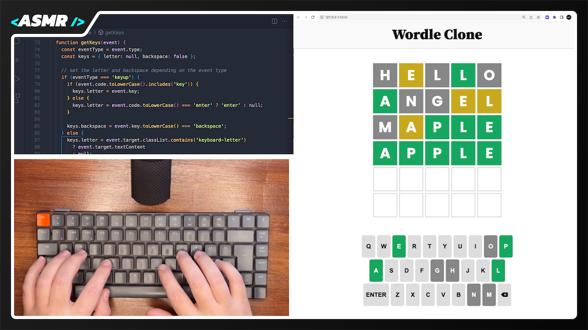

# Wordle Clone | WebDevASMR

Develop a Wordle clone using HTML, CSS, and JavaScript in this ASMR Programming tutorial.

[Watch the video here:](https://youtu.be/MoYswcVQprM?sub_confirmation=1)

## API

This app uses the [DataMuse](https://datamuse.com) `words` API.
